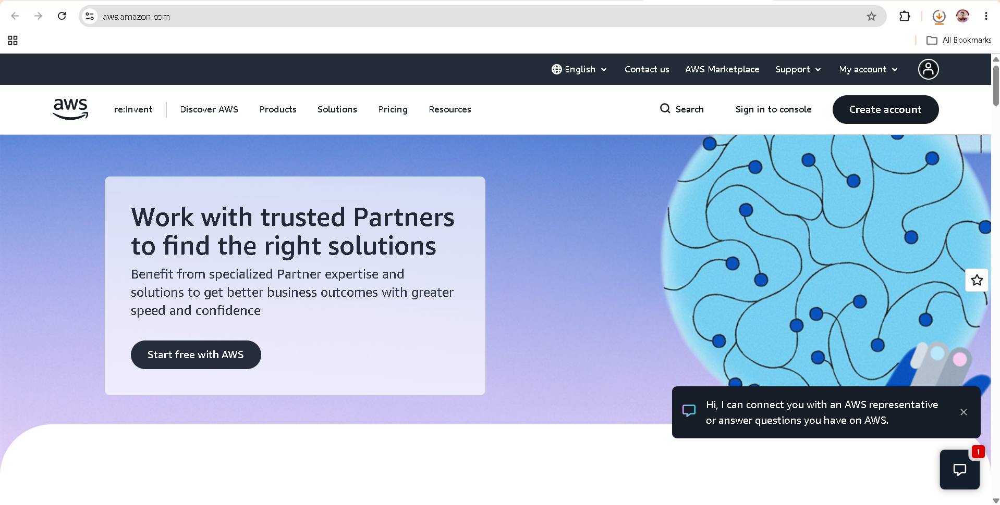

# Amazon Web Services (AWS) Research

## 1. Brief Overview

Amazon Web Services (AWS) is a cloud computing platform provided by Amazon. It offers a wide range of cloud services that organizations can use for computing, storage, databases, networking, security, analytics, and other IT needs. AWS allows businesses to use cloud resources without having to maintain all of their own physical infrastructure.

## 2. Global Infrastructure

AWS operates its cloud infrastructure through geographic Regions and Availability Zones. A Region is a separate geographic area, while Availability Zones are isolated locations within a Region. AWS uses these locations to support highly available and reliable applications.

## 3. Cloud Management Console

The AWS Management Console is a web-based interface used to access and manage AWS services. Users can create and configure resources, monitor services, manage security settings, and control their cloud environment through the console.

### AWS Homepage Screenshot

## 4. Four Core Services

| Service        | Description                                                             |
| -------------- | ----------------------------------------------------------------------- |
| **Amazon EC2** | Provides virtual servers for running applications and workloads.        |
| **Amazon S3**  | Provides scalable object storage for files and other data.              |
| **Amazon VPC** | Allows users to create and manage an isolated virtual network in AWS.   |
| **AWS IAM**    | Controls access to AWS resources through users, roles, and permissions. |

## 5. Three Advantages

1. **Wide range of services** – AWS provides many services for different computing and business requirements.
2. **Global infrastructure** – AWS provides infrastructure across many geographic regions, allowing organizations to deploy applications closer to their users.
3. **Scalability** – Organizations can increase or decrease cloud resources according to their workload requirements.

## 6. Typical Enterprise Use Cases

AWS can be used by enterprises for web and mobile applications, data storage, backup and disaster recovery, enterprise applications, databases, analytics, and large-scale cloud infrastructure. Its broad selection of services makes it suitable for organizations with different technical requirements.
