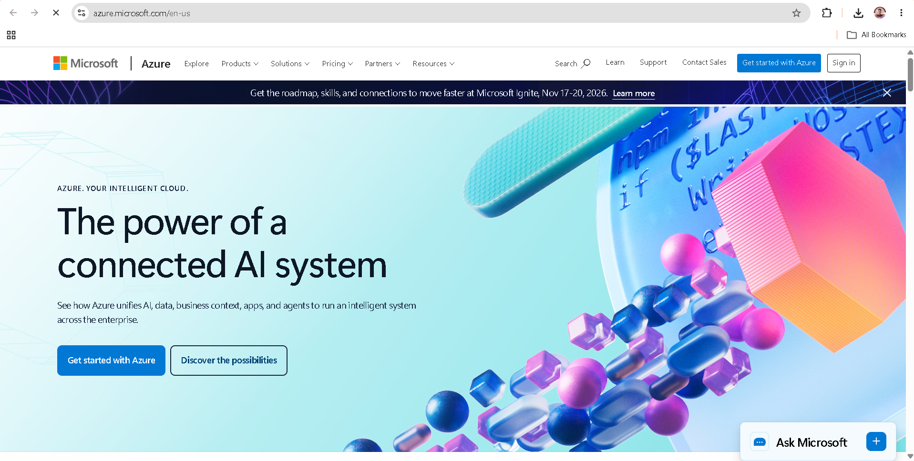

# Microsoft Azure Research

## 1. Brief Overview

Microsoft Azure is a cloud computing platform developed by Microsoft. It provides services for computing, storage, networking, databases, security, artificial intelligence, and application development. Azure is widely used by organizations that already use Microsoft technologies.

## 2. Global Infrastructure

Azure provides cloud infrastructure through regions and availability zones around the world. Availability zones are physically separate locations within supported Azure regions and are designed to improve application availability and resilience. Microsoft provides an interactive global infrastructure map showing Azure regions, locations, availability zones, products, and compliance information.

## 3. Cloud Management Console

The Azure portal is a web-based management interface used to create, configure, monitor, and manage Azure resources. It provides access to cloud services and management tools through a single interface.

### Azure Homepage Screenshot

## 4. Four Core Services

| Service                    | Description                                                                          |
| -------------------------- | ------------------------------------------------------------------------------------ |
| **Azure Virtual Machines** | Provides virtual machines for running applications and workloads.                    |
| **Azure Blob Storage**     | Provides object storage for unstructured data such as documents, images, and videos. |
| **Azure Virtual Network**  | Provides networking capabilities for Azure resources.                                |
| **Microsoft Entra ID**     | Provides identity and access management for users and applications.                  |

## 5. Three Advantages

1. **Microsoft integration** – Azure works closely with Microsoft products and technologies.
2. **Enterprise support** – Azure provides services and features designed for business and enterprise environments.
3. **Global infrastructure** – Azure provides regions and availability zones across many parts of the world.

## 6. Typical Enterprise Use Cases

Azure can be used for enterprise applications, Windows Server workloads, Microsoft 365-related environments, databases, virtual machines, application development, backup, disaster recovery, and artificial intelligence workloads. It is especially useful for organizations that already depend heavily on Microsoft's technology ecosystem.
