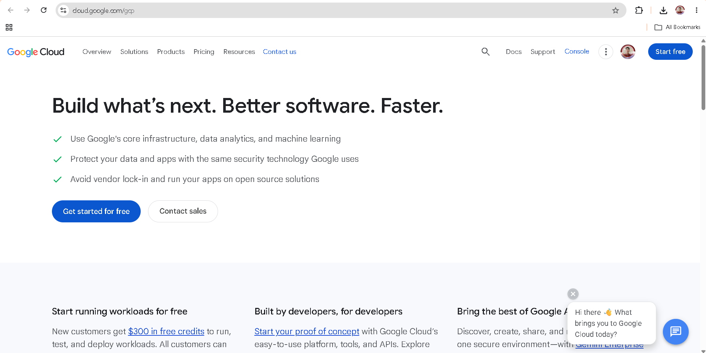

# Google Cloud Platform (GCP) Research

## 1. Brief Overview

Google Cloud Platform (GCP), commonly called Google Cloud, is Google's cloud computing platform. It provides services for computing, storage, networking, databases, artificial intelligence, machine learning, analytics, and application development.

## 2. Global Infrastructure

Google Cloud uses a global infrastructure made up of regions and zones. Its official cloud locations page currently lists **43 regions and 130 zones**, along with network infrastructure that supports applications around the world.

## 3. Cloud Management Console

The Google Cloud Console is a web-based interface for managing Google Cloud resources and services. Users can create resources, monitor applications, configure services, manage projects, and control access through the console.

### Google Cloud Homepage Screenshot

## 4. Four Core Services

| Service                            | Description                                                                         |
| ---------------------------------- | ----------------------------------------------------------------------------------- |
| **Compute Engine**                 | Provides virtual machines for running applications and workloads.                   |
| **Cloud Storage**                  | Provides object storage for data and files.                                         |
| **Google Kubernetes Engine (GKE)** | Provides a managed Kubernetes environment for deploying containerized applications. |
| **Cloud IAM**                      | Provides identity and access management for Google Cloud resources.                 |

Google Cloud's infrastructure documentation also identifies Compute Engine, Google Kubernetes Engine, Cloud Storage, and Cloud Identity among the products available across its regions.

## 5. Three Advantages

1. **Strong AI and machine learning capabilities** – Google Cloud provides technologies designed for AI and machine learning workloads.
2. **Kubernetes support** – Google Cloud provides Google Kubernetes Engine for managed Kubernetes deployments.
3. **Global network and infrastructure** – Google Cloud provides infrastructure across many regions and zones around the world.

## 6. Typical Enterprise Use Cases

Google Cloud can be used for artificial intelligence and machine learning, data analytics, containerized applications, web applications, virtual machines, databases, and global applications. It is particularly useful for organizations working with large amounts of data, AI workloads, and Kubernetes-based applications.
